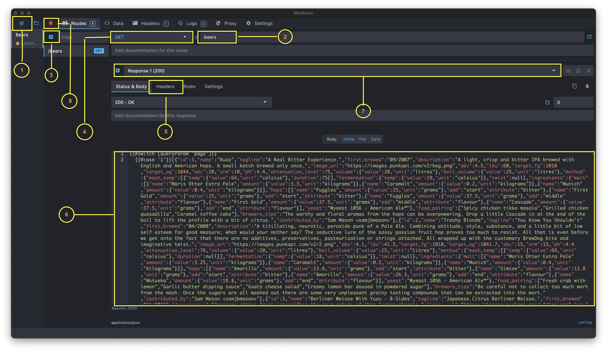
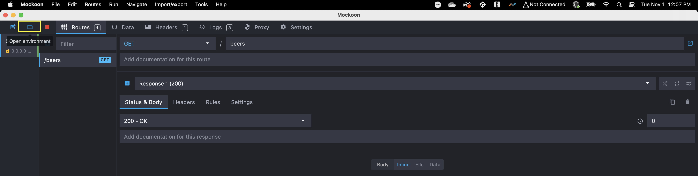
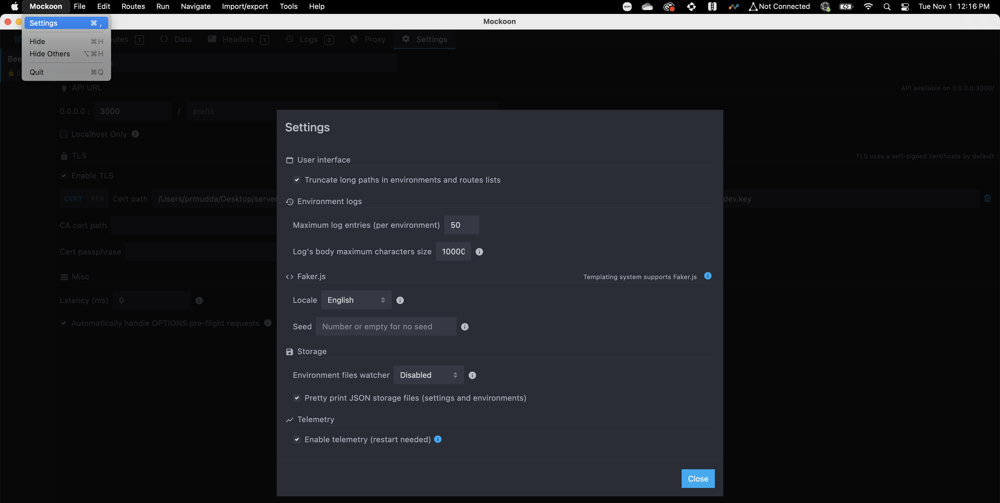
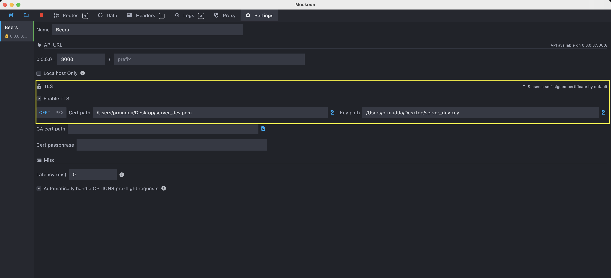
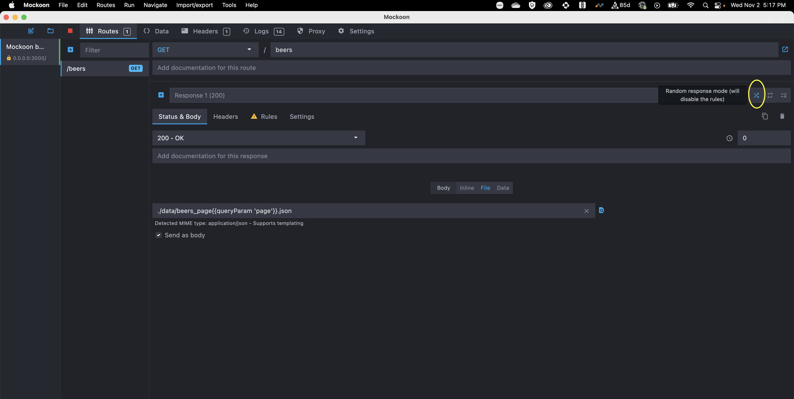

Attribution: Original of this document was copied from the Android smart start and modified for iOS

## Mockoon

Mockoon is the easiest and quickest way to run mock APIs locally. No remote deployment, no account required, free and open-source.

It's a desktop application that offers a fast and easy-to-use interface and a CLI that help you work faster with APIs by mocking them and thus improve your integration tests, speed up your development, etc.

For more information on Api mocking see https://mockoon.com/articles/what-is-api-mocking/

## Install the application:

  Mockoon is available on the three major operating systems: Windows, macOS, and Linux.

  You can download it here: https://mockoon.com/download/

## Create New mock API:

  <table style="border-spacing: 0px;">
  <tr>
  <td></td>
  </tr>
  </table>

The above screenshot shows the Mockoon Interface and below steps to create Mock API

  1 - Add Environment:

  The Mock APIs are called "Environment" in Mockoon. One environment is one project, so if you're working on 2 different apps/projects, you'll need to create a separate "environment" for each project.
  To create a new mock API,  click on the "New environment" button in the top left corner. You'll be prompted to save the environment's JSON file.

  2 - Add Environment route:

  This is the part of URL which goes after the base URL and before the API Endpoint.

  Eg: https://www.example.com/api/v1/login
  api/v1 is the environment route.

  To keep your mock API structure as close to your actual API URLs, you can add same route to your base URL. 

  3 - Add your API route:

  This is the actual API Endpoint. Examples of this would be /login, and we created /beers as (shown in the screenshot) for our beers recipe app.

  4 - Add API method:

  This would be the API method — GET, POST, PUT, DELETE.
  
  5 - Add response headers:

  You can add custom headers for your API. The most common is setting the content type for the response. 
  It can easily be set by clicking on Headers -> Add Header -> Add Header Name (Eg. Content-Type) -> Set Value (Eg. application/json)
  
  6 - Add response:

  Type your response JSON here that you would want to return from the API. You can type any JSON response you want. I just copied the data from assets/beers.json file.

  You can also select the file option and attach a JSON file instead of typing the JSON.

  Mockoon allows to generate random dynamic mock data of any types(JSON, CSV, XML, HTML, etc.)

  For generating dynamic responses Mockoon provides:

  Helpers: see  https://mockoon.com/docs/latest/templating/mockoon-helpers/

  Request helpers: see  https://mockoon.com/docs/latest/templating/mockoon-request-helpers/

  Faker.js helpers: see  https://mockoon.com/docs/latest/templating/fakerjs-helpers/

  7 - For testing the various response codes you can change the response codes from the drop down menu.

  You can enable/disable flag icon in the dropdown to make default responses.

  You can enable/disable response modes by selecting the options on the right corner of the dropdown.

  8 - Start Mockoon server to access your API:

  Whenever any changes are made Start/Refresh the server.

  Note: For this API to be accessible from your mobile app while developing/testing, your Mockoon server and your mobile should be connected to the same network.

  For more information see https://mockoon.com/tutorials/getting-started/

## Sharing a mock API:

Since v1.16.0, there is no need to export in Mockoon's format on one computer and re-import on another one.

After locating your environment file, you can share it with your coworkers by using Git for example. 
  
You coworkers can then save the file in any folder and open it directly using the "Open environment" button.
  
  <table style="border-spacing: 0px;">
  <tr>
  <td></td>
  </tr>
  </table>

By default, an environment file JSON content is saved pretty-printed to allow comparing changes between two commits. You can disable pretty printing in the settings
  
  <table style="border-spacing: 0px;">
  <tr>
  <td></td>
  </tr>
  </table>

## Creating self-signed certificates :

  see https://medium.com/@noumaan/ssl-app-dev-a2923d5113c6 for creating your self-signed- certificates.

  You can find the self signed certificate in {repository_root}/Documentation/Mockoon/self_signed_certificate/.

  You need to add these self signed certificate or create your own self signed certificates when you create new Mock Environment in Mockoon over TLS.

## TLS support:

Mockoon supports serving your mock API over TLS with a self-signed certificate by default.

To Enable the TLS option go to Mockoon, click the settings tab at the top and then tick the Enable TLS checkbox. 

The option is successfully activated if a yellow lock is displayed next to the environment name.
  
You may need to restart your environment for the change to take effect.

Your mock API will now be available on https://localhost:port(for iOS https://10.0.2.2:3000) instead of http://localhost:port().

You can also provide your certificate in both PKCS12 or PEM formats by filling out the input fields with the Cert path and the Key path to the file(s).

You can find the self signed certificate in {repository_root}/Documentation/Mockoon/self_signed_certificate/.

  <table style="border-spacing: 0px;">
  <tr>
  <td></td>
  </tr>
  </table>

## Testing MockAPI from the URLSession-Example App
 
Follow the following steps to test MockAPI:

1. Download and Install Mockoon on your machine.

You can download it here: https://mockoon.com/download/

2. In Mockoon go to File> Open Environment

   * Navigate to {repository_root}/Documentation/Mockoon/.

   * Select mockoon_beers.json

   * Click open.

This will open Mockoon_beers Environment in Mockoon interface.

4. In Mockoon go to Run > Start/Stop/Reload current environment

This will start the server on your local machine.

5. Build and run the URLSession-Example scheme from Xcode.

6. Once the Beer Recipes screen is loaded, navigate to the settings app -> URLSession-Example 

7. Click on the "Beer API" and select "LOCAL" environment

8. Kill and relaunch the app

9. List of Beer Recipes with Mock data is shown on the screen.(The MockAPI returns 200 OK response).

## Testing MockAPI for Error Flows

1. In Mockoon click on Random response mode option.

This will randomly generate different response codes(200, 400, 403, 404, 500).

Random response mode button is highlighted with yellow circle in the below screenshot.

  <table style="border-spacing: 0px;">
  <tr>
  <td></td>
  </tr>
  </table>

2. In Mockoon go to Run > Start/Stop/Reload current environment

3. Relaunch the URLSession-Example app. Currently there is no way to refresh the list of beers without restarting the app

4. If you get 200 response code you will see List of Beer Recipes. 

If you get response code other then 200 ie 400, 403, 404 , 500 , you will see an error state.

For more information on different Route responses see https://mockoon.com/docs/latest/route-responses/multiple-responses/