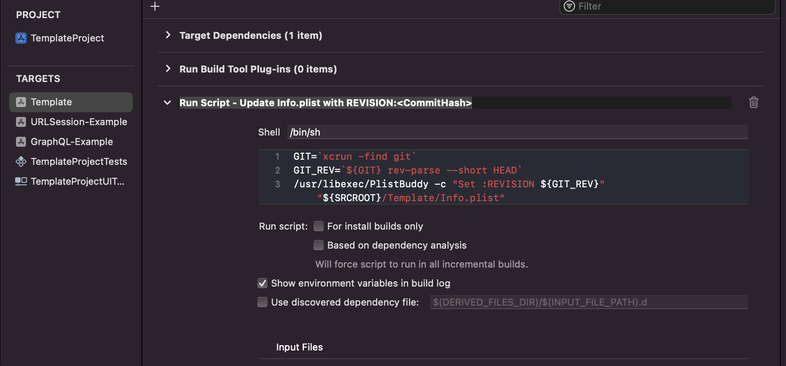

# App Version 

## Semantic Version Numbering

We use the [Semantic Versioning](https://semver.org/) scheme to name our app (and API) versions. It consists of three numbers, separated by periods, that represent major, minor, and patch releases, e.g.:

2.4.3 is the 3rd patch release of the 4th minor release of the 2nd major release.

Release numbers can only ascend over time, with the precedence order being major > minor > patch. 

Any change that would require a forced upgrade (enforced via a kill-switch mechanism that must be baked into the app) must increment the major release number.

## QA and UAT Builds

In the case of builds that are used by QA for integration testing or by users and stakeholders for beta and UA testing, it is useful to display the specific Git commit hash as part of the app version. This ensures that when bugs are written, the exact source version for the build that was tested is known, since the semantic app version is not incremented for interim test builds.

The SmartStart template includes this by default. A ‘Run Script’ Build Phase is included that updates the Info.plist file during the build with a new ‘REVISION’ key that has the value of the current commit hash found by running the ‘git rev-parse’ command. 

Because this updates the Info.plist file, thus marking it dirty in Git, we run another script at the end of the build to undo this change, ‘Run Script - Undo  Add REVISION to Info.plist’.

In addition, since we do not want the commit hash showing in a production build, we use the **PROD** Active Compilation Condition flag to conditionally omit it in a production build. 

