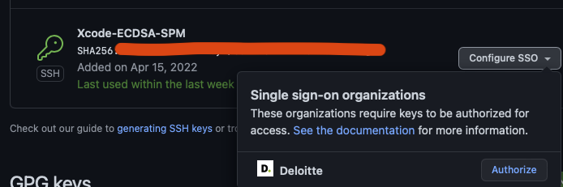
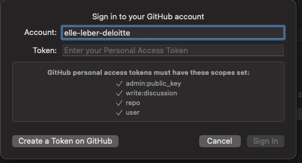
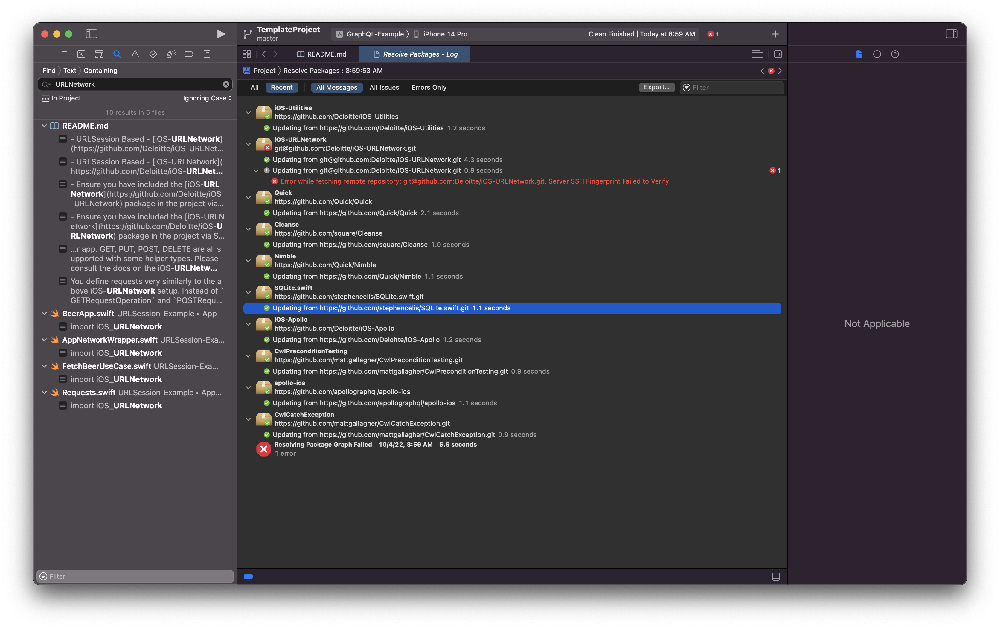
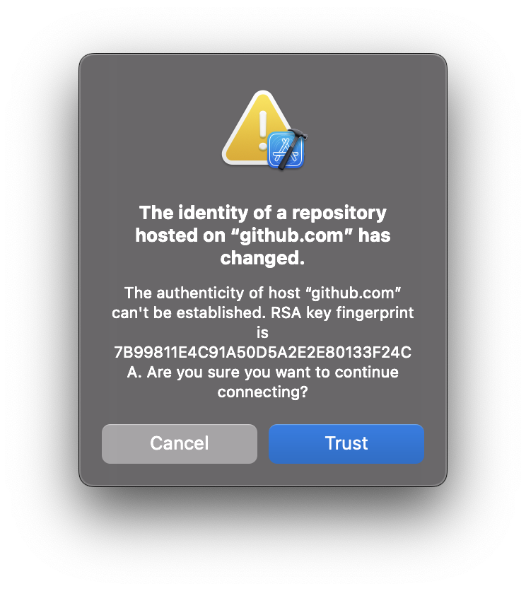
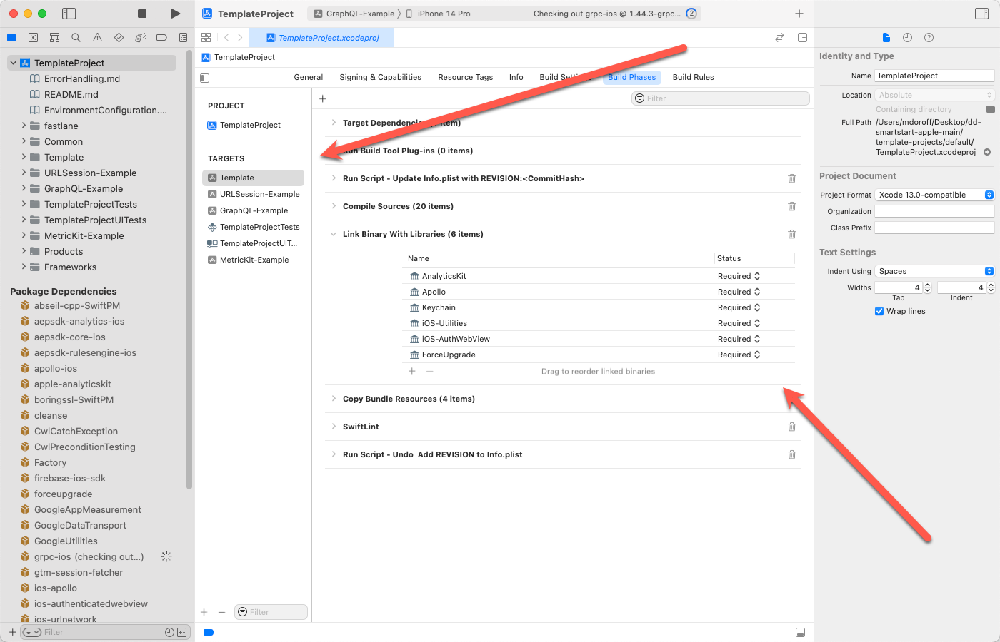
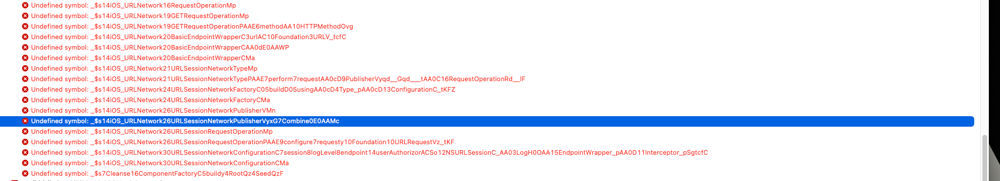

# What is this?

This is a SmartStart template that comes pre-loaded with a lot of common boiler-plate code included that would otherwise be time-consuming to set up. This also includes some best practices and patterns that can be followed when building out an application. Please check the Example applications, one that uses a RESTful API and one that uses graphQL.

**Currently this project supports only iOS 15 and up. If your project requires iOS 14 or older, the template will be much more difficult to get working.**

# What is included in the Template by default?

- Unit testing frameworks [Quick and Nimble](https://github.com/Quick/)
- Leverages SPM (Swift Package Manager) for dependency management
- Fastlane skeleton for CI (fastlane.io for more)
- Swiftlint (see .swiftlint.yml in the root of the project)
- Analytics Kit, analytics wrappr - [Apple-AnalyticsKit](https://github.com/Deloitte/Apple-AnalyticsKit)
- Support Utilities - [iOS-Utilities](https://github.com/Deloitte/iOS-Utilities)
- Some helper code found in ./Common of this project

# Patterns Used

There are a few different patterns enforced here with some example app code on the `Example` branch of this project.

- MVVM using a reducer pattern - [Overview](https://www.vadimbulavin.com/modern-mvvm-ios-app-architecture-with-combine-and-swiftui/)
- SwiftUI Coordinator pattern to enable programtic navigation within SwiftUI (i.e. handling deep or universal links) (Coordinator and DeepLinks)[https://quickbirdstudios.com/blog/swiftui-navigation-deep-links/]
  This is still a mostly in progress venture

# Getting Started

## Setting up your environment

The project uses homebrew for swift lint and ruby gems for a few tools

### Xcode and HomeBrew

- Ensure Xcode 14 is set up
  - install, run, and close Xcode
- [install Homebrew](https://brew.sh)

### Configuring Ruby

The project uses some ruby gem packages, it's best to configure you're own ruby instead of trying to use the system ruby. (Using the system ruby also requires liberal use of sudo everywhere).
Here is one way to simply manage ruby on your machine using [RVM](https://rvm.io)

- Install RVM from [rvm.io](https://rvm.io)
- Using RVM, install ruby version 2.7.2
  - `$ rvm list known`
  - `$ rvm install ruby-2.7.2`
    This will take a few minutes.
- Once it has finished, please open both your ~/.profile and ~/.bash\_profile and ensure the following line is present (if not please add it)
  - `[[ -s "$HOME/.rvm/scripts/rvm" ]] && source "$HOME/.rvm/scripts/rvm" # Load RVM into a shell session *as a function*`
- Restart your shell

Ruby should now work properly without needing to use sudo or cause any issues with the system ruby installed by MacOS.

## Configuring SPM to work with Deloitte GitHub Packages

### Github SSH token

You will need to set up your SSH key properly for Xcode SPM to work with the way Deloitte's github security is configured. **Several people have had issues on this step. If you get failures to load these internal (Deloitte) packages, see Troubleshooting steps below for guidance.**

- as of Xcode 14, You will **need** to create a ECDSA SHA SSH key as that is what SPM in Xcode seems to want.
- Please follow the github guide [here](https://docs.github.com/en/authentication/connecting-to-github-with-ssh/generating-a-new-ssh-key-and-adding-it-to-the-ssh-agent)
  - **Important Note** You need to make sure you generate the key using the ecdsa algorithm, change the ssh-keygen line to the following
  - `$ ssh-keygen -t ecdsa -C "your_email@deloitte.com"`
- Once the key is uploaded to github you will need to configure it for SSO
- Go to your SSH keys in github settings
- Click the "Configure SSO" drop down and ensure its authorized for the Deloitte Studios organization
  

### Github Personal Access Token

Swift Package Manager in Xcode requires the use of a Persoonal access token set up within Xcode itself in order to work properly

- Open Xcode
- Open Preferences
- Go to "Accounts"
- Click "+"
- Select "Github" and click Continue
- Go to github and create a PAT - [Instructions here](https://docs.github.com/en/authentication/keeping-your-account-and-data-secure/creating-a-personal-access-token)
  - It must have the following scopes enabled
    
- Enter your deloitte org enabled account name (i.e. elle-leber-deloitte)
- Paste the token you just created, ensure that when you set up the token it has the correct scopes that Xcode wants
- Click "Sign In"
- If it succeeded go back to the PAT you just created and **configure it for SSO** (this will have you link it with your Deloitte Studios Org SSO)
- Back in Xcode accounts, select Clone using "SSH" and pick the SSH key we set up earlier above (the ecdsa one)

## Checking Out the Project

- Download the project from the `main` branch. This will give you a clean slate to start with. You will want to make sure you download the source instead of cloning so that you do not have .git files included.
- Prior to trying to build the project, **place it under GIT control** (`git init`). There is a 'Run Script' build phase that calls git to get the commit hash to display in the app, and the build will fail if git has not been initialized.

## Setting up the project

- install the ruby gem Bundler, there are a couple of ruby tools used with this project, please check the Gemfile for a list.
- run `$ bundle install`
- when running a fastlane lane please call `$ bundle exec fastlane [lane_name]` to ensure you use the version of fastlane included with the project.
- set up swift lint
  - run `$ brew install swiftlint`
- when building the app, swiftlint will automatically run. Please see the .swiftlint.yaml file if you'd like to change anything
  - Swiftlint also can be ran from fastlane along with a CI set up if desired.

## What to change?

**Important!** Much of the SmartStart functionality is broken up into Swift Packages. Please take a look at [Package_Overview.md](./Package_Overview.md) to determine what additional Swift Packages you may want to add.

- Delete the three Example targets (URLSessionExample, GraphQLExample, and MetricKit-Example) as well as the folder's containing code. You will be using the final "Template" target. This will be renamed to your client's app name.
- Rename the entire project file.
  1. Select your project in the Project navigator.
  1. In the Identity and Type section of the File inspector, enter a new name into the Name field.
  1. Press Return.
  1. A dialog is displayed, listing the items in your project that can be renamed. The dialog includes a preview of how the items will appear after the change.
  1. To selectively rename items, disable the checkboxes for any items you don’t want to rename. To rename only your app, leave the app selected and deselect all other items.
  1. Click Rename.
- Rename the "Template" target to your client's application name
- Rename the scheme "Template" if necessary
- Rename the testing targets as well
- Add or remove swift package dependencies you will need or want for the project via swift package manager

## Need to upload to the client's repo?

Client repo or engineers will not be able to access Deloitte's github instance so you will need to do a few additional things

- You will need to copy over the packages you are using into the project source code
- Suggest creating a folder in "Common" or in the root of the project called "Packages"
- in the bottom of the project navigator where Xcode lists package dependencies. Right click and "Show in Finder", from here you will need to copy the "source" folders from each Deloitte package from here into the folder above. These need to be added to the target and treated as normal source files. *NOTE* You should only need to do this for the Deloitte packages, anything open source (i.e. quick, nimble, Apollo) can stay within the package manager as they are publicly available.
- You may need to remove some extraneous import declarations since those packages are now added directly as source files.
- Finally, verify you can still build and run app
- Push up the code to your client's repo.
**Additional information and specifics on how to port over each package can be found on the respective package's github page**

## Troubleshooting

### Failure to load Deloitte internal GitHub packages because of invalid SSH fingerprint

- Ensure you have created a **ECDSA** SHA SSH key as described in the GitHub SSH token section above
- Ensure you have uploaded the key to GitHub **AND** configured it for SSO (see GitHub SSH section above)
- Ensure you have followed **ALL** the step in the Github Personal Access Token section, including **configuring it for SSO.**
- If all those have been done, and you are still getting a failure like THIS:
  
- The red error line is actually clickable (very discoverable, NOT!), and doing so brings up the following dialog, and clicking the "Trust" button will probably fix your issue:
  

### General Build Failures

- You may encounter issues when you're trying to build the Template project and that's by design. Depending on which type of networking you choose, GraphQL or URLSession, you'll need to add the corresponding package to the Link Binary with Libraries section of the Build Phases.

- The error that you will see when you try to `import` from iOS-URLNetwork or iOS-Apollo and you have not added the corresponding library to tho Link Binary With Libraries section is an undefined symbol error. Here is an example when trying to use iOS-Apollo.

